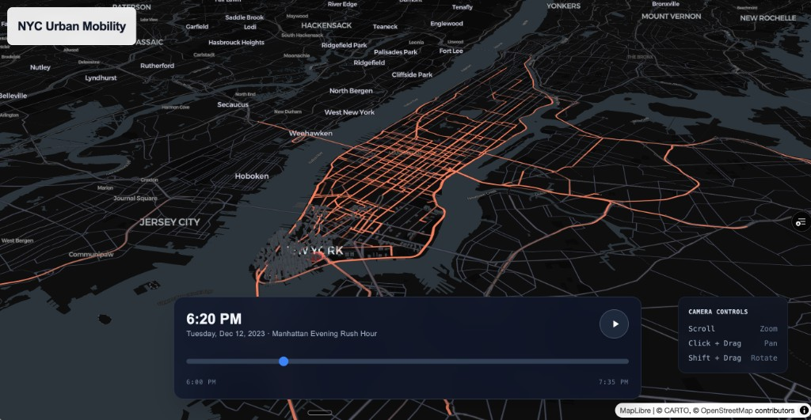
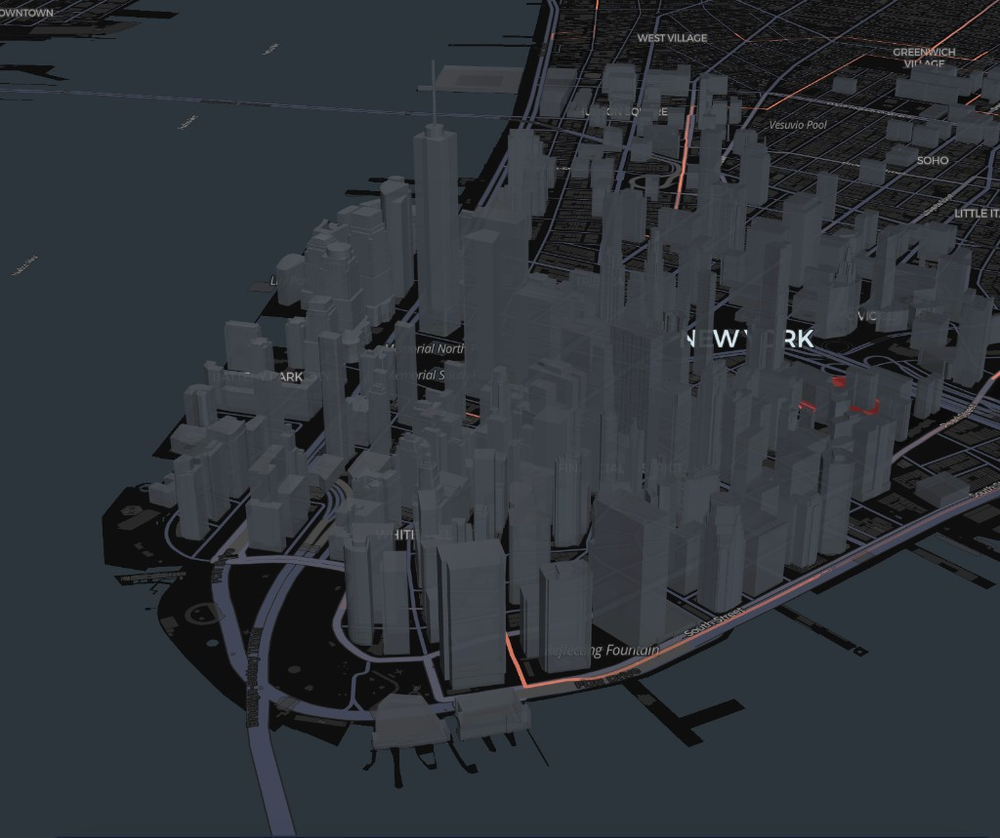
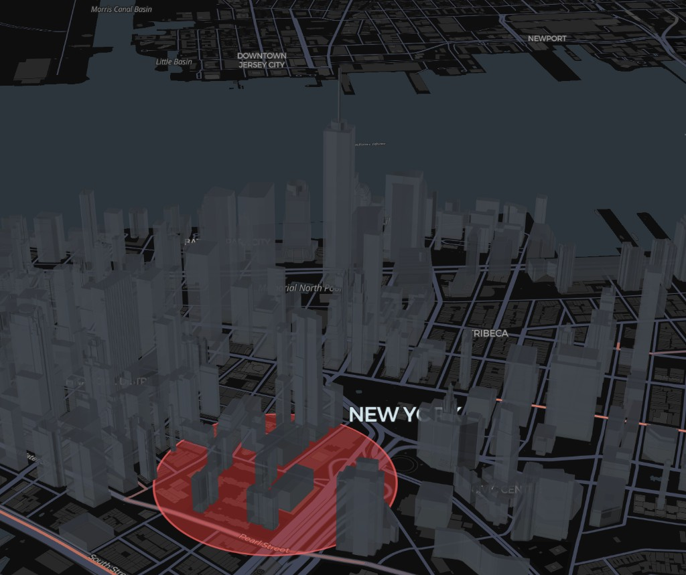

# NYC Urban Mobility

[](https://nyc-urban-mobility.vercel.app/)


Interactive 3D geospatial storytelling for NYC taxi movement, street-level travel paths, and the pulse of Lower Manhattan.

**Live app:** [nyc-urban-mobility.vercel.app](https://nyc-urban-mobility.vercel.app/)



| Financial District focus | Trip layer motion |
| --- | --- |
|  |  |

## Overview

NYC Urban Mobility turns taxi trip activity into an explorable 3D city scene. It combines an elevated Manhattan map, extruded building footprints, animated trip paths, and a time scrubber so viewers can understand how movement changes during an evening rush window.

From a product perspective, the app is built as a focused mobility intelligence experience rather than a generic dashboard. It highlights where demand concentrates, how trips move through dense downtown corridors, and how high-activity areas emerge around the Financial District.

The UX is designed for quick visual comprehension. Users can pan, zoom, rotate, play or pause the rush-hour timeline, and jump into a highlighted hotspot without needing to read dense tables or interpret raw trip records.

The centerpiece is the Deck.gl `TripsLayer` motion visualization. Animated paths trace taxi movement through Lower Manhattan while a pulsing Financial District hotspot calls attention to outbound demand, making urban mobility patterns visible as motion instead of static points.

## Tech Stack

| Area | Technology |
| --- | --- |
| App framework | Next.js App Router, React 19 |
| Language | TypeScript (strict) |
| Styling | Tailwind CSS, shadcn/ui |
| Map renderer | MapLibre GL via `react-map-gl` |
| Visualization | Deck.gl `TripsLayer`, `PolygonLayer`, `ScatterplotLayer` |
| Vector tiles | PMTiles (served from static CDN via HTTP Range requests) |
| State and interaction | Zustand for UI state, Deck.gl internal clock for animation |
| Data API | Next.js Route Handlers |
| Data store | Supabase PostgreSQL + PostGIS via Drizzle ORM, with local JSON fallback |
| ETL | DuckDB, Socrata NYC Open Data, OSRM routing, Supabase seed scripts |
| Observability | Sentry (errors and performance), PostHog (product analytics) |
| Testing | Playwright (visual smoke tests, E2E) |
| Deployment | Vercel |

## High-Level Architecture

```text
┌─────────────────────────────────────────────────────────────────────┐
│                              End User                               │
│          browser, pointer controls, timeline scrubber, playback      │
└───────────────────────────────┬─────────────────────────────────────┘
                                │
                                ▼
┌─────────────────────────────────────────────────────────────────────┐
│                         Next.js App Router                          │
│  app shell, metadata, static assets, route handlers, Vercel deploy   │
└───────────────┬─────────────────────────────────────┬───────────────┘
                │                                     │
                ▼                                     ▼
┌───────────────────────────────┐       ┌─────────────────────────────┐
│       Client WebGL View       │       │        /api/trips           │
│  MapLibre basemap             │       │  reads Supabase trips       │
│  Deck.gl TripsLayer           │       │  falls back to local JSON   │
│  3D buildings + hotspot       │       └──────────────┬──────────────┘
│  timeline and camera controls │                      │
└───────────────┬───────────────┘                      ▼
                │                         ┌───────────────────────────┐
                │                         │ Supabase PostgreSQL       │
                │                         │ vendor_type, routed path  │
                │                         └───────────────────────────┘
                ▼
┌───────────────────────────────┐
│ Static Geospatial Assets      │
│ buildings, basemap style,     │
│ congestion and sample trips   │
└───────────────────────────────┘
```

## ETL Pipeline

```text
┌──────────────────┐   ┌──────────────────┐   ┌──────────────────┐   ┌──────────────────┐   ┌──────────────────┐
│ NYC TLC /        │   │ Stage 1: DuckDB  │   │ Stage 2: OSRM    │   │ Stage 3:         │   │ Runtime          │
│ Socrata Open     │──▶│ Aggregate        │──▶│ Routing          │──▶│ Supabase Seed    │──▶│ Visualization    │
│ Data             │   │ join zones and   │   │ build street     │   │ insert vendor    │   │ /api/trips feeds │
│ trips + zones    │   │ derive centroids │   │ paths + times    │   │ type + path      │   │ Deck.gl motion   │
└──────────────────┘   └──────────────────┘   └──────────────────┘   └──────────────────┘   └──────────────────┘
                              │                      │
                              ▼                      ▼
                    output_centroids.json     routed_trips.json
```

## Run Locally

```bash
npm install
npm run dev
```

Then open [http://localhost:3000](http://localhost:3000).

`/api/trips` reads from Supabase when `DATABASE_URL` is configured. If Supabase is not configured, it falls back to the local routed trip file generated by the ETL scripts.

## Data Notes

The app uses preprocessed trip paths rather than live vehicle telemetry. NYC TLC records provide trip origins, destinations, and timestamps; the ETL pipeline converts those records into route-shaped paths suitable for Deck.gl animation. This keeps the experience lightweight enough for a portfolio-style Vercel deployment while preserving the visual logic of real urban movement.

## Prerequisites

- **Node.js** 20.x or newer
- **npm** 10.x (or pnpm / yarn equivalent)
- **WebGL2-capable browser** (recent Chrome, Firefox, Safari, or Edge)
- **Optional, for running the ETL pipeline locally:**
  - DuckDB CLI ≥ 1.0
  - An OSRM routing endpoint (self-hosted or public) for street-level path snapping
  - A Supabase project (PostgreSQL + PostGIS) for seeding routed trips

## Available Scripts

| Script | Purpose |
| --- | --- |
| `npm run dev` | Start the Next.js dev server with Turbopack on `localhost:3000` |
| `npm run build` | Build the production bundle |
| `npm run start` | Run the built production server |
| `npm run typecheck` | Run `tsc --noEmit` to validate TypeScript |

## Environment Variables

Create a `.env.local` file at the project root. **Do not commit this file.**

| Variable | Required | Purpose |
| --- | --- | --- |
| `DATABASE_URL` | Required for live data | Supabase / Postgres connection string used by `/api/trips` to read routed trips. When unset, the API falls back to the local JSON file produced by the ETL pipeline. |
| `SOCRATA_APP_TOKEN` | Optional | NYC Open Data app token used by the ETL ingestion scripts. Raises Socrata rate limits to ~1k requests/hour. Not required at runtime. |

## Testing

Visual smoke tests and end-to-end coverage are run with **Playwright**.

```bash
npx playwright install   # one-time browser download
npx playwright test      # run the suite
npx playwright test --ui # interactive runner
```

## Data Attribution & Credits

- **Trip records** — [NYC Taxi & Limousine Commission (TLC)](https://www.nyc.gov/site/tlc/about/tlc-trip-record-data.page), via [NYC Open Data](https://opendata.cityofnewyork.us/) (Socrata).
- **Taxi zones** — NYC TLC Taxi Zone shapefiles (NYC Open Data, public domain).
- **Street network and routing** — [OpenStreetMap](https://www.openstreetmap.org/copyright) contributors (ODbL), routed via [OSRM](https://project-osrm.org/).
- **Basemap** — [Carto](https://carto.com/) "Dark Matter" / light style, built on OpenStreetMap data.
- **3D building footprints** — NYC Department of City Planning (NYC Open Data).
- **Rendering libraries** — [MapLibre GL JS](https://maplibre.org/) and [Deck.gl](https://deck.gl/) (Vis.gl / OpenJS Foundation).

## Known Limitations

- **Preprocessed, not live.** Trip paths are routed and seeded ahead of time; this is not a real-time vehicle feed.
- **Scoped to a rush-hour window over Lower Manhattan.** The current experience is intentionally narrow to keep payloads small and the visual story focused.
- **Sampled trip volume.** The visualization renders a sampled subset of TLC trips suitable for portfolio-grade Vercel deployment, not the full TLC corpus.
- **Desktop-first.** Touch and small-viewport ergonomics are minimal; the camera/timeline are tuned for pointer + keyboard.
- **Requires WebGL2.** Older browsers, locked-down enterprise environments, or devices without hardware acceleration may render poorly or not at all.

## License

MIT — see [`LICENSE`](./LICENSE) for details.
